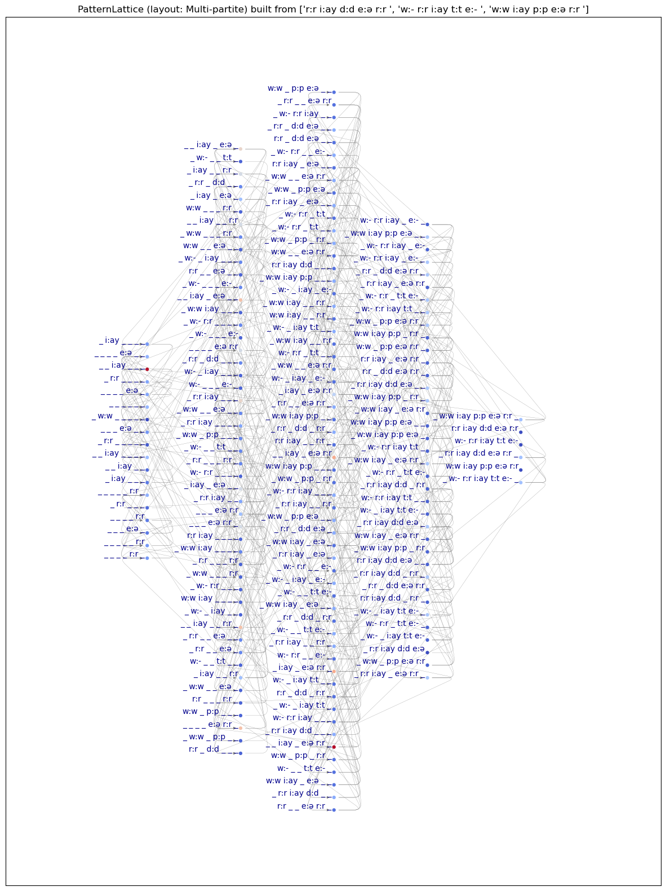

# Pattern-Lattice-Builder
A Python implementation of generalized Pattern Lattice Builder (gPLB). Confirmed to run on Python 3.6 and above (but not guaranteed to run on 3.12, 3.13)

# Synopsis
gPLB implements a _generalized_ Pattern Lattice. A normal, _non-generalized_ Pattern Lattice of [a, b, c] is the is-a network over the set
{[\_, \_, \_],
[a, \_, \_], [\_, b, \_], [\_, \_, c],
[a, b, \_], [a, \_, c], [\_, b, c],
[a, b, c] } of six elements.
But in the generelized form, the resulting Pattern Lattice of the same input is the is-a network over the set
{ [\_, \_, \_],
[a, \_, \_], [\_, b, \_], [\_, \_, c],
[a, b, \_], [a, \_, c], [\_, b, c],
[a, b, c],
[\_, \_, \_, \_],
[a, \_, \_, \_], [\_, b, \_, \_], [\_, \_, c, \_],
[a, b, \_, \_], [a, \_, c, \_], [\_, b, c, \_],
[a, b, c, \_],
[\_, a, \_, \_], [\_, \_, b, \_], [\_, \_, \_, c],
[\_, a, b, \_], [\_, a, \_, c], [\_, \_, b, c],
[\_, a, b, c],
[\_, \_, \_, \_, \_],
[\_, a, \_, \_, \_], [\_, \_, b, \_, \_], [\_, \_, c, \_, \_],
[\_, a, b, \_, \_], [\_, a, \_, b, \_], [\_, \_, b, c, \_],
[\_, a, b, c, \_]} of 31 (= 8+8+7+8) elements.
This makes gPLB different from its predecessor [RubyPLB](https://github.com/yohasebe/rubyplb), a Ruby implementation of Pattern Lattice Builder.

Additonally, gPLB, unlike RubyPLB, gives you a lot of analytical information in text format. For example, it gives you:

- all the instantiation (is-a) links generated
- all the nodes created for a pattern lattice with z-scores

gPLB also allows you specify parameters to draw graphs interactively.

gPLB implements _content tracking_, through which contents of variables, symbolized as "_" or "…" can be inspected. I believe this functionality is quite useful to make more detailed analysis of data.


## gPLB (a package including a runnable script)
[gPLB](gPLB) is a package that can be run as a script. To run it, issue the following command in the terminal:

```python gPLB [OPTIONS] <file>```

where `<file>` is an input file in .csv format. Crucial options are:

- -n [int] sets the number of instances to handle using random sampling.
- -m [int] sets the maximum number of segments in each instance.
- -f [str] sets the field separator (defaults to ",") to the one you choose.
- -g [str] sets the gap_mark (defaults to "\_") to the one you choose.
- -C [flag] sets off automatic capitalization of tokens
- -H [flag] sets off automatic subsegmentation of hyphenated tokens
- -P [flag] sets off automatic removal of isolated punctuation marks such as ",", "." from input
- -G [flag] produces the ungeneralized version of Pattern Lattice instead of the generalized version (default).
- -z, -zl [float] sets the lower limit of z-score to prune the unwanted nodes. This is truly useful when a Pattern Lattice grows a big and complex.
- -zu [float] sets the upper limit of z-score to prune the unwanted nodes. This is truly useful when a Pattern Lattice grows a big and complex.
- -Z [flag] flag to use robust (i.e., median-based) z-score instead of normal (i.e., mean-based) z-score.
- -L [str] selects graph layout. Default is 'Multi_partite', a (clumsy) NetworkX-based simulation of RubyPLB output, but other graph layouts like Graphviz [-L G], ARF [-L ARF], Fruchterman-Reingold [-L FR], Kamada-Kawai [-L KK], Spring [-L Sp], Shell [-L Sh], Circular [-L C], etc., are available, using layout options offered by NetworkX. Some layouts give a better description of the structure of the (generalized) Pattern Lattice networks.
- -D [flag] flag to draw diagrams without specifying layout.
- -A [flag] sets on automatic figure sizing to produce a better diagram. Useful at running on terminal rather than in Jupyter Notebook.
- -J [flag] set multibyte font to display. Setting up for a font path may be also needed. This depends on your system configuration.

## gPLB-runner (Jupyter Notebook)

[gPLB-runner.ipynb](gPLB-runner.ipynb) is a Jupyter Notebook that runs gPLB interactively. This is a better way to experiment, I suppose, especially when you need to customize graph drawing.

The following graph is a sample of Pattern Lattice generated from [XiY-wiper3-dual](sources/plb-XiY-wiper3-dual.csv) with pruning of nodes with z-scores less than 0.0 using gPLB-runner.ipynb. It would be quite difficult to produce graphs like this by running gPLB as a script since a lot of frustrating adjustments should be needed.

{width=100}

## gPLB-runner-on-bare-items (Jupyter Notebook)

[gPLB-runner-on-bare-items.ipynb](gPLB-runner-on-bare-items.ipynb) is a Jupyter Notebook that runs gPLB interactively. The difference from the Jupyter Notebook above is that this accepts bare, unsegmented words as input. You can select a subset of words in an input file using regex. Since this script builds a merged lattice gradually, it is able to accept more instances and even longer instances without falling into memory-runout error. If you change field separator to r"[,;:]?\s*", you can process raw sentences as input.

## Information

- [Pattern Lattice as a mode for liniguistic knowledge and performance](https://aclanthology.org/Y09-1030.pdf)
